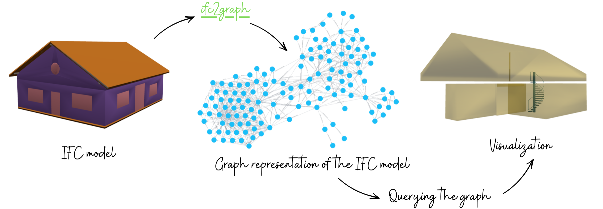
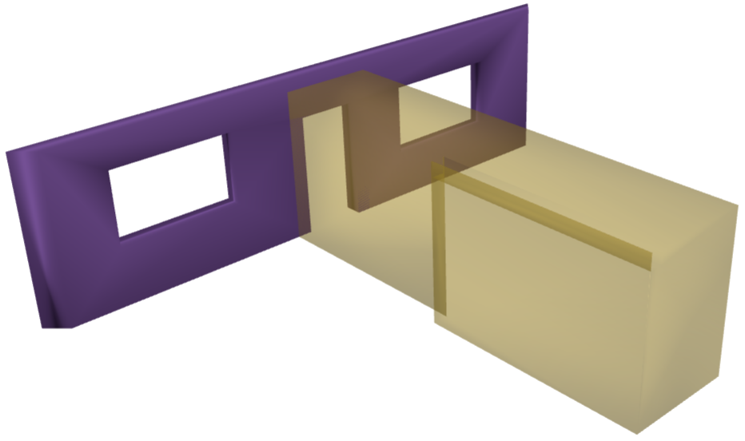
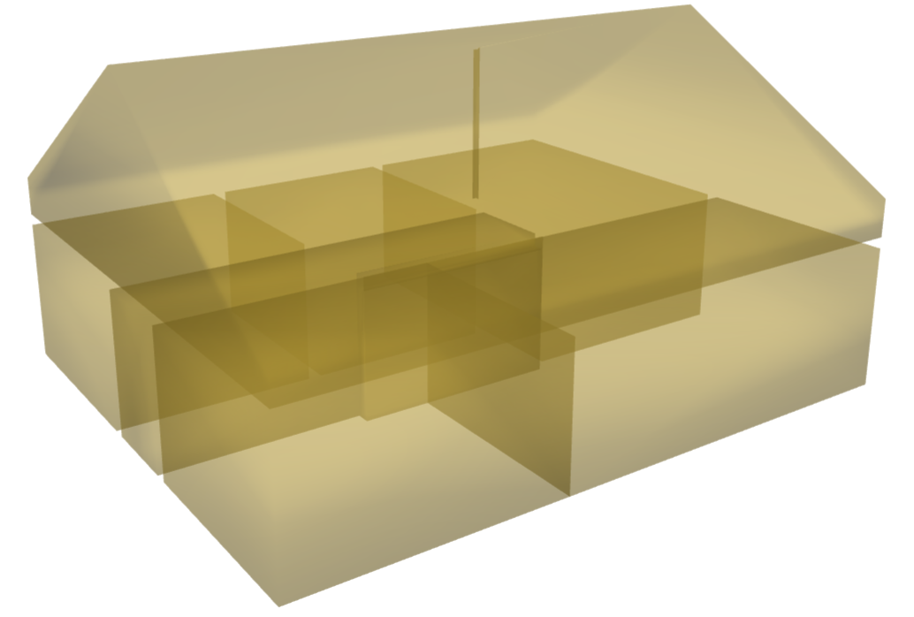
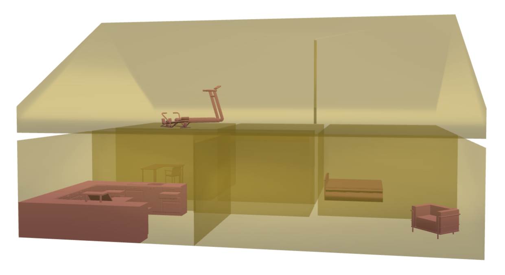

# ifc2graph

Convert an IFC model into a graph.
{ .tagline }

<figure markdown="span">
  
  <figcaption>The referenced IFC model is <a href="https://www.ifcwiki.org/index.php?title=KIT_IFC_Examples">FZK-Haus</a>.</figcaption>
</figure>

ifc2graph loads every building element (`IfcElement` and `IfcSpace`) in an IFC model, runs clash detection (`protrusion`, `pierce`, or `collision`) on their geometry, and writes the resulting nodes and edges to a graph database. The graph generation is solely based on geometries and not on IFC relationship entities.

<b>The underlying idea is simple.</b> For every element in the IFC model, candidate elements are first identified using a [BVH tree](https://docs.ifcopenshell.org/ifcopenshell-python/geometry_tree.html). Clash detection is then performed against these candidates, and whenever the triangulated meshes of two elements are found to clash, ifc2graph connects them in the graph.

Overall, ifc2graph is useful for:

- treating an IFC file as a queryable graph of elements and spaces
- inferring adjacency from geometric interaction rather than from IFC relationship entities
- tracing navigable routes (via rooms, doors, and stairs) as paths through the graph
- inspecting how two elements interact, whether by protrusion, pierce, or collision


!!! note
    Because the graph is derived from geometric clashes rather than from IFC relationship entities, it supports queries that an incompletely authored IFC model may not answer. This includes finding a [path between two rooms](querying.md#path-between-two-rooms), locating [where a furnishing element sits](querying.md#where-is-this-furnishing-element), recovering [what walls belong to a room](querying.md#what-walls-belong-to-this-room), checking [which rooms share a wall](querying.md#which-rooms-share-this-wall), listing [what opens into a room](querying.md#what-opens-into-this-room), and determining [which rooms a stair serves](querying.md#which-rooms-are-served-by-the-stair). This is only a shortlist 🙂
    
    Further queries, with outputs and visualizations, are available on the [examples](querying.md) page.

## Install

Requires Python 3.10 or newer.

```bash
pip install ifc2graph
```

For step-by-step setup, see [Installation](installation.md).

## Usage

### Graph generation

The API is straightforward. Pass an IFC model, Neo4j connection details (and optional arguments) to `ifc2graph()`.

```python
from ifc2graph import ifc2graph

clashes = ifc2graph(
    "model.ifc",    # IFC model                  
    
    # Neo4j connection
    uri="bolt://localhost:7687", 
    user="neo4j",
    password="password",
 
    # optional arguments are tolerance and allow_touching.
)
```

```text title="Example output (FZK-Haus)"
Model loaded in 0.26 seconds.
138 elements retrieved.
Clash detection started.
Clashes detected in 0.13 seconds.
Writing 531 clash relationships to Neo4j.
Neo4j written in 6.25 seconds.
```

!!! tip
    `clashes` is a list of `Clash` objects (`element1`, `element2`, `rel_type`, `collision_type`), one per unique pairwise clash. This list can be iterated over directly and <b>written to another database or pipeline</b> as well.

#### Optional arguments

| Argument | Default | Meaning |
| --- | --- | --- |
| `tolerance` | `0.002` | Intersection tolerance (0.002 -> 2mm) |
| `allow_touching` | `True` | Count zero-volume touches as collisions. Set to `False` to keep only overlaps that have volume. |

!!! note
    <b>Relationship direction</b>. Relationships in the graph represent clashs between two elements and are therefore semantically undirected. `A` clashing `B` is the same fact as `B` clashing `A`. Neo4j stores relationships with a direction, but this direction is used only as a storage convention and does not carry semantic meaning. During clash detection, element pairs are canonicalized by sorting their identifiers, so each pair is stored only once. Queries should therefore use undirected Cypher patterns such as `(a)--(b)` or `(a)-[r]-(b)`.

### Visualization

Elements can also be visualized in a web browser by passing IFC `GlobalId` values (GUIDs) to `visualize()`:

```python
from ifc2graph import load_model, visualize

model = load_model("model.ifc")
# visualize(model, [GUIDs])

# e.g., Visualizing selected elements by directly using their GUIDs
visualize(model, ["3rPX_Juz59peXXY6wDJl18", "3$f2p7VyLB7eox67SA_zKE"])
```

<figure class="viz-preview" markdown="span">
  
  <figcaption>Example output (FZK-Haus). The two GUIDs relate to the Wall and the Space shown in the figure.</figcaption>
</figure>

Below are some more examples:

```python
from ifc2graph import load_model, visualize

model = load_model("../models/FZK-Haus.ifc")

# visualizing all spaces
elements = model.by_type("IfcSpace")

# visualizing all spaces + furnishing elements
# elements = model.by_type("IfcFurnishingElement") + model.by_type("IfcSpace")

visualize(model, [e.id() for e in elements])
```

<figure class="viz-pair" markdown="span">
  
  
  <figcaption>Example outputs (FZK-Haus). The first figure shows all spaces, and the second one shows all spaces + furnishing elements.</figcaption>
</figure>


!!! warning
    **The target Neo4j database is cleared on every run** (`MATCH (n) DETACH DELETE n`) before anything is written. Point this at an empty or disposable database.


## Citation
Please cite the following paper if you use ifc2graph in your work:

<div class="bibtex-wrap" markdown>
```bibtex
@article{lamsal2026ifcllm,
      title={IfcLLM: Natural Language Querying of IFC Models through Complementary Relational and Graph Representations}, 
      author={Rabindra Lamsal and Sisi Zlatanova and Haowen Xu and Yafei Sun and Johnson Xuesong Shen},
      year={2026},
      eprint={2605.13236},
      archivePrefix={arXiv},
      primaryClass={cs.CL},
      url={https://arxiv.org/abs/2605.13236}, 
}
```
</div>
