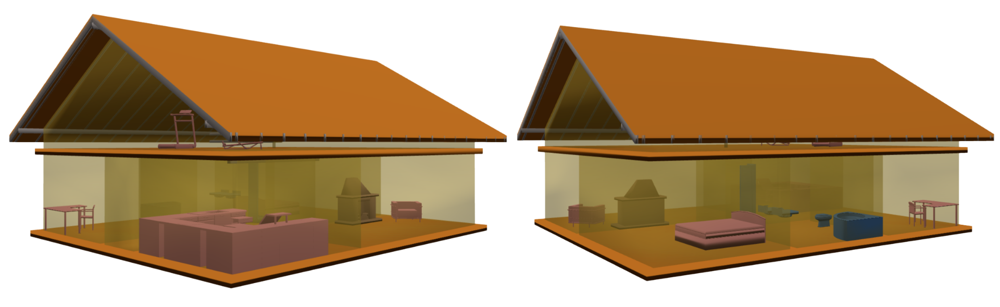
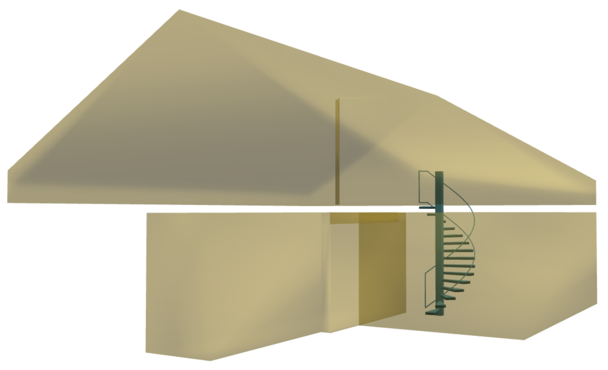
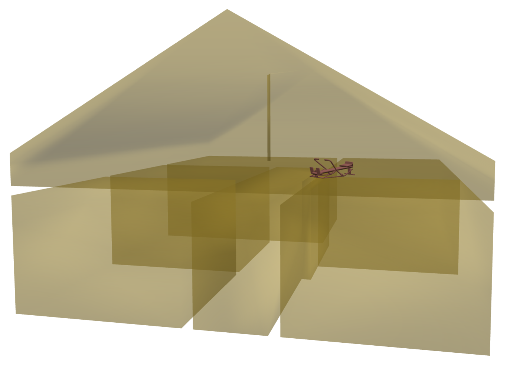
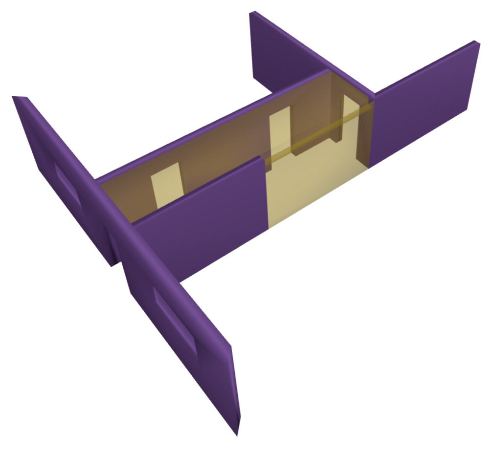
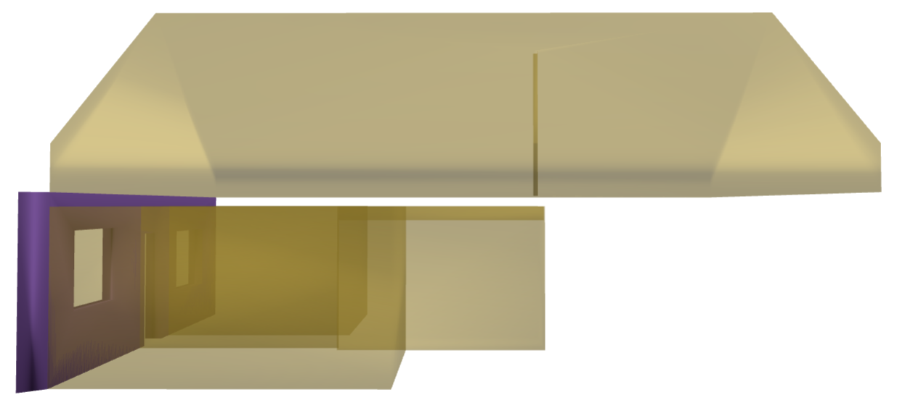
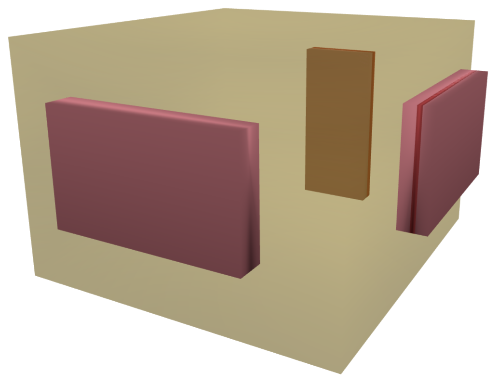
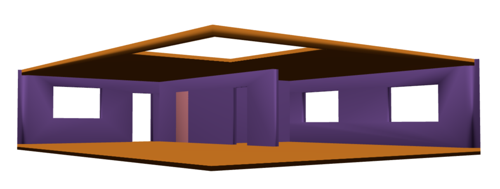
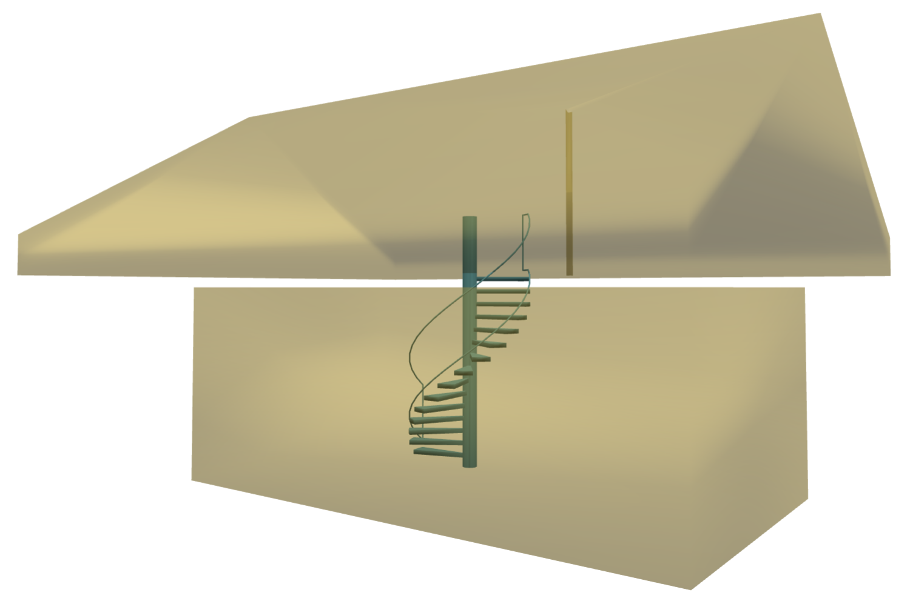

# Examples

Here are a few Cypher queries to get started with a Neo4j graph generated by ifc2graph. The IFC model queried below is <a href="https://www.ifcwiki.org/index.php?title=KIT_IFC_Examples">FZK-Haus</a> which can be downloaded from [here](assets/models/FZK-Haus.ifc). 

<i>Note: The FZK-Haus model was created by Institute for Automation and Applied Informatics (IAI) / Karlsruhe Institute of Technology (KIT)</i>.


### Getting started

First list what the IFC file contains.

```cypher
MATCH (n:BuildingElement)
RETURN n.ifc_class AS class, count(*) AS n
ORDER BY n DESC
```

```text title="Output"
class,n
IfcBeam,51
IfcOpeningElement,17
IfcFurnishingElement,15
IfcWallStandardCase,13
IfcWindow,11
IfcSpace,7
IfcFlowTerminal,6
IfcDoor,5
IfcVirtualElement,4
IfcSlab,4
IfcRailing,2
IfcColumn,1
IfcStair,1
IfcDistributionFlowElement,1
```

Next, let's list all elements with a non-empty `name`.

```cypher
MATCH (n:BuildingElement)
WHERE n.name <> ""
RETURN n.ifc_class, n.name, n.global_id
ORDER BY n.ifc_class, n.name
```

```text title="Output"
n.ifc_class,n.name,n.global_id
IfcBeam,First,20bTaetQDApP5w8egFxj13
IfcBeam,Holzbalken-1,11AyI2dXD3Of1cpyMmRVOe
IfcBeam,Holzbalken-2,31Jr0dMVnB6wFBfMSDFMJu
IfcBeam,Holzbalken-3,32VaklvYr2ORMiXJqZweAD
IfcBeam,Holzbalken-4,1X4dAmiW97Nurao$8fngpg
...
...
IfcColumn,Holzstuetze-1,1FnVzZtET9CQDoxryuX4cb
IfcDistributionFlowElement,Kamin,2v4ganR1z3h8MICjc5$5KK
IfcDoor,Haustuer,2jTRqchjf7oB0yhQ6462T0
IfcDoor,Innentuer-1,1Oms875aH3Wg$9l65H2ZGw
IfcDoor,Innentuer-2,0pGAjlJMP3ifYPATVF5xAR
IfcDoor,Innentuer-3,2qiPPF3FrF8OIqfrKiSUqm
IfcDoor,Terrassentuer,1M$gxUrX1Fiwe3P64ww7U5
IfcFlowTerminal,Badewanne,2kMJb9nSP6cQTEwW5_e1pQ
IfcFlowTerminal,Dusche,34$3o1rlX6PxkMZXYNMcgc
IfcFlowTerminal,Duschwanne,20p4aMxXD0WAfsG4MsKwZr
IfcFlowTerminal,WC,34CRPiY0z9Lh0Imdh7izir
IfcFlowTerminal,Waschbecken-1,2aGMqTvDr2Eg3eQpuzXNjm
IfcFlowTerminal,Waschbecken-2,1mH5QEeEDEKuaeQ_66WGpg
IfcFurnishingElement,Buerostuhl,0_4FBVad5CdPiQPFwm0ZTR
IfcFurnishingElement,Buerotisch,3Xf76okXb0JeRzkFfHr86j
IfcFurnishingElement,Doppelbett,3CF666a3P6svf9FiTvqQHX
IfcFurnishingElement,Kuechenschrank 1,2pk5$TMeTAfP$Cf$5S2PfR
IfcFurnishingElement,Kuechenschrank 2,167KXdKof41x8LiwyqdgRN
...
...
```


!!! note
    Filter on `ifc_class` rather than on the relationship type: `Space-Wall` and `Wall-Space` describe the same kind of contact in opposite A/B order.


Now, let's visualize some of the IFC classes.

```python
from ifc2graph import load_model, visualize

model = load_model("FZK-Haus.ifc")

elements = model.by_type("IfcSlab") + model.by_type("IfcDistributionFlowElement") + model.by_type("IfcSpace") + model.by_type("IfcBeam") + model.by_type("IfcFurnishingElement")
visualize(model, [e.id() for e in elements])

# this visualizes IfcSlab, IfcDistributionFlowElement, IfcSpace, IfcBeam, and IfcFurnishingElement
```

<figure markdown="span">
  
  <figcaption>Visualizing selected IFC classes: IfcSlab, IfcDistributionFlowElement, IfcSpace, IfcBeam, and IfcFurnishingElement.</figcaption>
</figure>


The queries below are the kind this graph answers well, since all of them infer meaning from clash. A furniture item counts as "in" a room if it clashes with that `IfcSpace`. A route between rooms is a path restricted to spaces, doors, stairs, and similar navigable elements.

Let's see some examples.

### Path between two rooms

Restricting the walk to navigable elements keeps the path from passing through a slab or a wall instead of a door. Here is a Cypher query that identifies a walkable path from room <b>1</b> to room <b>7</b>.

```cypher
MATCH (a:BuildingElement {ifc_class: "IfcSpace", name: "1"}),
      (b:BuildingElement {ifc_class: "IfcSpace", name: "7"})
MATCH p = shortestPath((a)-[*..20]-(b))
WHERE ALL(n IN nodes(p) WHERE n.ifc_class IN [
  "IfcSpace", "IfcDoor", "IfcStair",
  "IfcStairFlight", "IfcRamp", "IfcRampFlight"
])
RETURN [n IN nodes(p) | n.name + " (" + n.ifc_class + ")"] AS route,
       length(p) AS hops
```

```text title="Output"
route,hops
"[1 (IfcSpace), 5 (IfcSpace), Wendeltreppe (IfcStair), 7 (IfcSpace)]",3
```

<figure markdown="span">
  
  <figcaption>Visualizing the elements in the route from above.</figcaption>
</figure>

!!! tip
    Drop `IfcStair` and `IfcStairFlight` from the list for a step-free route.

### Where is this furnishing element?

Let's now search for a room that contains the furnishing element (`Rudermaschine`).

```cypher
MATCH (f:BuildingElement {name: "Rudermaschine"})--(s:BuildingElement)
WHERE f.ifc_class IN ["IfcFurnishingElement"]
  AND s.ifc_class = "IfcSpace"
RETURN f.name AS item, s.name AS room, s.global_id
```

```text title="Output"
item,room,s.global_id
Rudermaschine,7,2dQFggKBb1fOc1CqZDIDlx
```

<figure markdown="span">
  
  <figcaption>Visualizing the furnishing element (Rudermaschine) and all spaces.</figcaption>
</figure>


### What walls belong to this room?

Let's now search for walls that belong to room <b>1</b>.

```cypher
MATCH (s:BuildingElement {ifc_class: "IfcSpace", name: "1"})--(w:BuildingElement)
WHERE w.ifc_class IN ["IfcWall", "IfcWallStandardCase"]
RETURN w.name, w.global_id, w.ifc_class
```

```text title="Output"
w.name,w.global_id,w.ifc_class
Wand-Ext-ERDG-1,3rPX_Juz59peXXY6wDJl18,IfcWallStandardCase
Wand-Int-ERDG-5,1$wmdwWPjDYuku_ghVkynE,IfcWallStandardCase
Wand-Int-ERDG-4,2XPyKWY018sA1ygZKgQPtU,IfcWallStandardCase
Wand-Int-ERDG-2,3PfS__Y_DBAfq5naM6zD2Z,IfcWallStandardCase
Wand-Int-ERDG-3,3jjW3rL656ex34Gws22EfM,IfcWallStandardCase
```

<figure markdown="span">
  
  <figcaption>Visualizing all walls touched by room 1.</figcaption>
</figure>


### Which rooms share this wall?

```cypher
MATCH (w:BuildingElement {name: "Wand-Ext-ERDG-1"})--(s:BuildingElement)
WHERE w.ifc_class IN ["IfcWall", "IfcWallStandardCase"]
  AND s.ifc_class = "IfcSpace"
RETURN s.name, s.global_id
```

Also useful for adjacency checks, acoustic analysis, or fire compartmentation studies.

```text title="Output"
s.name,s.global_id
1,3$f2p7VyLB7eox67SA_zKE
6,17JZcMFrf5tOftUTidA0d3
2,2RSCzLOBz4FAK$_wE8VckM
7,2dQFggKBb1fOc1CqZDIDlx
```

<figure markdown="span">
  
  <figcaption>Visualizing all rooms shared by wall "Wand-Ext-ERDG-1".</figcaption>
</figure>

### What opens into this room?

Here we explore what doors, windows and openings belong to room <b>2</b>.

```cypher
MATCH (s:BuildingElement {ifc_class: "IfcSpace", name: "2"})--(o:BuildingElement)
WHERE o.ifc_class IN ["IfcDoor", "IfcWindow", "IfcOpeningElement"]
RETURN o.ifc_class, o.name, o.global_id

UNION

MATCH (s:BuildingElement {ifc_class: "IfcSpace", name: "2"})--(op:BuildingElement)--(o:BuildingElement)
WHERE op.ifc_class = "IfcOpeningElement"
  AND o.ifc_class IN ["IfcDoor", "IfcWindow"]
RETURN o.ifc_class, o.name, o.global_id
```

```text title="Output"
o.ifc_class,o.name,o.global_id
IfcOpeningElement,,0_wr1YyJn40e1zOIOjpozG
IfcOpeningElement,,3movl7pYTEA8fIVnSqIzcM
IfcOpeningElement,,07VmyeyBL28wLwezn9tmyV
IfcWindow,EG-Fenster-6,1srAI$R4T8ihLXSNHmUSET
IfcWindow,EG-Fenster-1,1TAI4ouKX4Xx4lBDZIu5qM
IfcDoor,Innentuer-3,2qiPPF3FrF8OIqfrKiSUqm
```

<figure markdown="span">
  
  <figcaption>Visualizing room <b>2</b> and its openings.</figcaption>
</figure>

!!! note
    A door or window usually sits in the wall thickness, so it often clashes with its `IfcOpeningElement` rather than with the `IfcSpace` volume. Matching only `(space)--(door)` can miss the filling.

### What else touches this room?

Let's identify all elements that touch room <b>2</b>.

```cypher
MATCH (s:BuildingElement {ifc_class: "IfcSpace", name: "2"})--(e:BuildingElement)
RETURN e.ifc_class, count(*) AS n, collect(e.name)[0..8] AS examples
ORDER BY n DESC
```

```text title="Output"
e.ifc_class,n,examples
IfcWallStandardCase,4,"[Wand-Ext-ERDG-1, Wand-Ext-ERDG-2, Wand-Int-ERDG-3, Wand-Int-ERDG-1]"
IfcOpeningElement,3,"[, , ]"
IfcSlab,2,"[Bodenplatte, Slab-033]"
IfcFurnishingElement,2,"[Buerostuhl, Buerotisch]"
```

<figure markdown="span">
  
  <figcaption>Visualizing all elements that touch room <b>2</b>.</figcaption>
</figure>


### Spaces that share a slab (above or below)

```cypher
MATCH (s1:BuildingElement {ifc_class: "IfcSpace"})--(sl:BuildingElement)--(s2:BuildingElement {ifc_class: "IfcSpace"})
WHERE sl.ifc_class IN ["IfcSlab", "IfcRoof"]
  AND s1.global_id < s2.global_id
RETURN s1.name, sl.name, s2.name
```

```text title="Output"
s1.name,sl.name,s2.name
5,Bodenplatte,3
5,Slab-033,3
5,Bodenplatte,6
3,Bodenplatte,6
5,Slab-033,6
3,Slab-033,6
5,Bodenplatte,2
3,Bodenplatte,2
6,Bodenplatte,2
5,Slab-033,2
3,Slab-033,2
6,Slab-033,2
5,Slab-033,7
3,Slab-033,7
6,Slab-033,7
2,Slab-033,7
5,Bodenplatte,1
3,Bodenplatte,1
6,Bodenplatte,1
2,Bodenplatte,1
5,Slab-033,1
3,Slab-033,1
6,Slab-033,1
2,Slab-033,1
7,Slab-033,1
5,Bodenplatte,4
3,Bodenplatte,4
6,Bodenplatte,4
2,Bodenplatte,4
1,Bodenplatte,4
5,Slab-033,4
3,Slab-033,4
6,Slab-033,4
2,Slab-033,4
7,Slab-033,4
1,Slab-033,4
```

### Which rooms are served by the stair?

Let's now see which rooms are served by the only stair present in the model.

```cypher
MATCH (st:BuildingElement)--(s:BuildingElement {ifc_class: "IfcSpace"})
WHERE st.ifc_class IN ["IfcStair", "IfcStairFlight"]
RETURN st.name, collect(DISTINCT s.name) AS rooms_served
```

```text title="Output"
st.name,rooms_served
Wendeltreppe,"[5, 7]"
```

<figure markdown="span">
  
  <figcaption>Visualizing the rooms connected by the only stair in the IFC model.</figcaption>
</figure>


### Class-to-class clash-type counts


```cypher
MATCH (a:BuildingElement)-[r]-(b:BuildingElement)
WHERE a.global_id < b.global_id
RETURN a.ifc_class, b.ifc_class, r.clash_type, count(*) AS n
ORDER BY n DESC
```

```text title="Output"
a.ifc_class,b.ifc_class,r.clash_type,n
IfcBeam,IfcBeam,pierce,84
IfcSlab,IfcBeam,collision,35
IfcSlab,IfcBeam,protrusion,30
IfcBeam,IfcBeam,collision,24
IfcBeam,IfcWallStandardCase,collision,23
IfcWallStandardCase,IfcWallStandardCase,collision,22
IfcBeam,IfcSpace,collision,20
IfcSpace,IfcWallStandardCase,collision,19
IfcSlab,IfcWallStandardCase,collision,15
IfcSpace,IfcBeam,collision,15
IfcWallStandardCase,IfcSpace,collision,13
IfcWallStandardCase,IfcBeam,collision,13
IfcBeam,IfcSlab,collision,12
IfcBeam,IfcSlab,protrusion,12
IfcSpace,IfcOpeningElement,collision,10
IfcOpeningElement,IfcWallStandardCase,collision,10
IfcSlab,IfcSpace,collision,9
IfcOpeningElement,IfcSpace,collision,8
IfcSpace,IfcFurnishingElement,protrusion,8
IfcFurnishingElement,IfcSpace,protrusion,7
IfcWallStandardCase,IfcSlab,collision,7
IfcOpeningElement,IfcWindow,protrusion,6
...
...
```